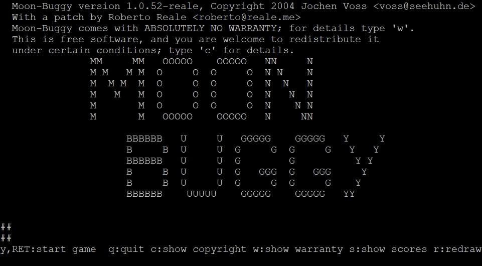

# moon-buggy

Drive some car across the moon.

The classical ascii-art game by [Jochen Voss](https://github.com/seehuhn), with
a patch of mine.

## Rationale

`moon-buggy` is an extremely simple game, yet one written with clarity and with
an obvious pedagogical goal in mind—as far as the code is concerned, as a
matter of fact.

I decided to write a patch against the original codebase in the mid 2000s, to
teach myself basic data structures and algorithms in C.

## Installation

Refer to the original [README](README) file for instructions.

Should you wish to compile from sources, a preliminary

    $ autoreconf --install

might be needed.

*— Roberto Reale*
